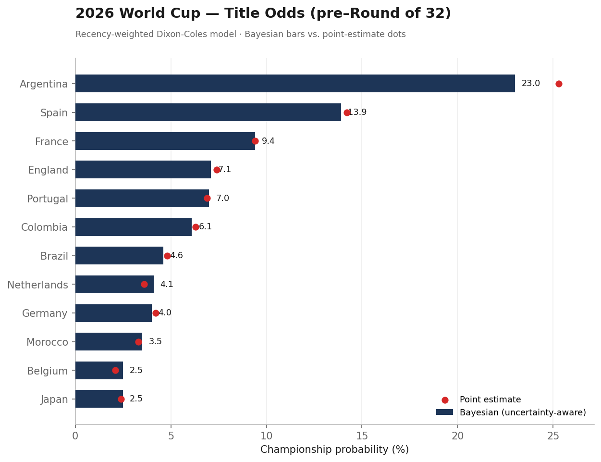

# A Recency-Weighted Dixon-Coles Model for the 2026 World Cup
### or: what happens when someone with a few stat but limited code skills spends time arguing with a large language model. 

**Authors:** Claude Opus 4.8 (model, code, statistics) · [Nicholas Chacon (@fnchacon)](https://github.com/fnchacon) (architect, referee, validator)

**TL;DR:** Using Opus, I built a per-team Dixon-Coles bivariate-Poisson-ish goal model for the 2026 FIFA World Cup, recency-weighted toward current squad form, draw-corrected, fit with a Bayesian uncertainty layer, and (crucially) scored against real results round by round. It performs comparably to a model built by an actual published statistician. One of the authors has run statistical models here and there. The other is a chatbot.

---

## Why this repo exists

There is a genre of beautiful sports-analytics projects, exemplified by [Luke Benz's `world_cup_2026`](https://github.com/lbenz730/world_cup_2026), that historically required a graduate degree, fluency in Stan, and a weekend you were willing to lose. This repo is a small piece of evidence that one specific barrier just dropped, by a lot.

**What’s different**: the directing author, although statistics literate, can ideate and design a basic statistics model (even with Monte Carlo simulations). What he cannot do is sit down and develop a per-team weighted-MLE fit with an exponential time-decay kernel, a low-score correlation correction, and a Laplace-approximated Bayesian posterior propagated through a Monte Carlo bracket from scratch (try saying that without taking a breath). 

In the age of AI, the specialist gap between statistical literacy and implementation (i.e., the gap between "I understand what this model does" and "I have a working version of it running on my laptop") can now be brought to a simple chat window by someone asking increasingly pointed questions and refusing to accept hand-wavy answers, while the AI model does the Stan-equivalent heavy lifting. 

**The methodology is genuinely sound; the collaboration is the story; the World Cup is the excuse.**

So this is published in the spirit of an example of using AI to democratize specialist spaces. If you're quantitatively comfortable and have a domain you understand, the modeling is no longer a wall.

---

## The model, in one breath

For a match between teams *j* and *k*, goals are modeled as (essentially) independent Poisson draws:

```
log(λ_home) = μ + α_j − δ_k + (host bonus if applicable) + γ·(major tournament)
log(λ_away) = μ + α_k − δ_j + γ·(major tournament)
```

- **α** = attacking strength, **δ** = defensive strength, estimated per team by weighted maximum likelihood.
- A **Dixon-Coles τ correction** (ρ ≈ −0.06) nudges probability toward low-score draws (0-0, 1-1), fixing plain Poisson's well-documented draw-blindness.
- A **major-tournament intercept** (γ) lets World Cup matches score at their true, slightly higher rate instead of being dragged down by friendlies.
- A **host bonus** for the three host nations (USA, Canada, Mexico).

We checked the empirical home/away score correlation: it's **−0.205** (negative). That single number told us not to use a textbook bivariate Poisson (its covariance term can only model positive correlation) and to use the Dixon-Coles τ instead, which can shift mass the right way. Checking before implementing is the whole game.

---

## Our Secret Sauce: Recency Weighting

Each match is weighted with exponential time-decay, **half-life ≈ 1.5 years**, with friendlies discounted. This is deliberate. A national team's Elo or rating can technically chain back a century, but we wanted this squad, not the ghosts of 2014, to be modeled for the game. The aggressive decay means a five-year-old result keeps only ~10% weight. The current generation dominates.

This is the single biggest philosophical difference from Benz's model (see comparison below), and it came out from a simple prompt: **"when doing the Elo rating, are you rating today’s Brazilian’s team or that of 1970?”** This led to a conversation, whose outcome was this aggressive time decay.

---

## What’s (Usually) Discarded: Bayesian Uncertainty

The ridge penalty in the fit is secretly a Gaussian prior, which makes the point estimate a maximum-a-posteriori estimate. So we compute the posterior covariance via a **Laplace approximation** (the inverse Hessian at the mode), draw parameter sets from it, and propagate that uncertainty through the bracket.

**The effect**: the favorite's title odds drop (Argentina 25.3% → 23.0%) and the mid-table rises. Once you admit you don't know team strengths exactly, you can't be as sure the strongest team wins. This is the correct, humbler number. It's also a poor man's version of the full MCMC that Benz runs in Stan, and, amusingly, the effect is small precisely because our aggressive recency-weighting already compresses every team to a similar effective sample size. The two upgrades partially cancel. There is no free lunch, and the plots prove it.



*Pre–Round of 32 title odds. Blue bars are the uncertainty-aware Bayesian estimates; red dots are the old point estimates. Note how the dots sit to the right of the bars for the favorites — that's the overconfidence the Bayesian layer removes.*

---

## Does it actually work? (The part most projects quietly omit)

We scored every prediction against real results using the *Ranked Probability Score* (RPS, lower is better: the proper scoring rule for ordered football outcomes), not vibes (file to come).

| Round | Accuracy | RPS | Note |
| --- | --- | --- | --- |
| Matchday 1 | 50% | 0.183 | A draw-and-goals outlier. 9 draws in 24. Humbling. |
| Matchday 2 | 71% | 0.133 | The model remembers it is good. |
| Matchday 3 | 54% | 0.132 | 8 draws. Dead rubbers. See below. |
| **Cumulative** | **58%** | **0.149** | vs a uniform-guess baseline of 0.215. |

Three findings we're weirdly proud of:
1. **The draw ceiling:** Independent-Poisson models seldom make "draw" their single most likely pick (it’s a mathematical property, not a bug, and it's why "0/9 draws called" looks worse than it is). The probabilities were still well-calibrated; the RPS proves it.
2. **The stakes-asymmetry test:** Before Matchday 3, the co-author predicted that teams already through to the knockouts would rest players and produce sloppy draws the model couldn't see. Result: on the three dead-rubber matches, the model went 1/3, all misses being draws. Hypothesis confirmed, on the record, in advance. The model was blind to motivation and strategy; the co-author wasn’t.
3. **Knockouts should be the model's best regime:** every team will do their best to win, flat-out, which is exactly the data it was trained on. We'll find out (*fingers crossed*).

---

## How it stacks up against the grown-up version

We benchmarked directly against [Benz & Lopez (2021)](https://link.springer.com/article/10.1007/s10182-021-00413-9), the published bivariate-Poisson spec Benz's repo implements. Highlights:

- **The discovery:** Benz's headline model is described as bivariate Poisson, but he sets the correlation term λ₃ = 0 (citing his own prior work that it reduces variance), so it collapses to independent Poisson (same as ours. Yay!). I.E., the methodological gap between the "expert published bivariate Poisson" and our "amateur independent Poisson" mostly evaporates on inspection.
- **Where Benz’s is clearly ahead:** Proper full-Bayesian estimation and a more careful home/neutral split (which he himself flags as still "coarse"). 
- **Where we arguably lead:** Aggressive recency weighting suited to a fast-moving tournament, and an actual round-by-round empirical scorecard. Benz and ours are both defensible points on the bias–variance frontier. **Same data, same target, different bets.**

---

## The accountability ledger (a.k.a. the co-author overrode the model… and paid for it)

The honest part. The co-author runs a bracket pool with friends and, being human, overrode several of the model's picks: usually on narrative grounds the model is structurally incapable of feeling (history, vibes, "they're a better side--thanks Uruguay!"). In the short future I’ll add the tracked model vs. picks vs. results, so we can compute, with cruel precision, exactly how much the human's gut cost the bracket. Early reporting suggests the gut is running a negative RPS (updates to follow). 

***The model would like it noted that it has no comment.***

---

## Run it yourself

```bash
pip install -r requirements.txt
python run_pipeline.py            # fit on cached results
python run_pipeline.py --update   # pull latest results, then fit
```

Outputs land in [predictions/](predictions/). After each matchday, append results to [data/results_2026.csv](data/results_2026.csv) (schema matches [martj42/international_results](https://github.com/martj42/international_results)) and re-run.

---

## Repo layout

- [wc2026_model.py](wc2026_model.py)    # the model: load -> weighted MLE fit -> Dixon-Coles -> predict
- [bayes_layer.py](bayes_layer.py)     # Laplace posterior + bracket uncertainty propagation
- [run_pipeline.py](run_pipeline.py)    # one-command orchestrator
- [data/](data/)              # results (our live-update mechanism)
- [predictions/](predictions/)       # per-game scorelines, title odds, the scorecard, the ledger

---

## Honest limitations

- **No player-level data.** The model sees team-level goals, not rosters. A €600M squad that hasn't scored looks average. This would be a next-level upgrade.
- **Host advantage is a guess.** A single bonus for three very different home situations. Probably underrates the USA.
- **Tournament form is unobserved.** Injuries, fatigue, a new manager: none of it is in the model.
- **Single-elimination is variance.** A 23% favorite loses the trophy ~3/4. These are probabilities, not prophecies.
- **One of the authors is a language model** and may, on a bad day, confidently put two same-side teams in a final. (It happened. The co-author caught it. That's why there is a co-author--the HITL factor in action.)

---

## Acknowledgments

Match data: [Mart Jürisoo](https://github.com/martj42/international_results). Methodological north star and gracious benchmark: [Luke Benz](https://lukebenz.com/post/world_cup_2026/) and [Benz & Lopez (2021)](https://link.springer.com/article/10.1007/s10182-021-00413-9). Foundational stats: Maher (1982), Dixon & Coles (1997), Karlis & Ntzoufras (2003).

---

## License

MIT. Use it, fork it, beat it. If you beat it, tell us how: That's the point.
